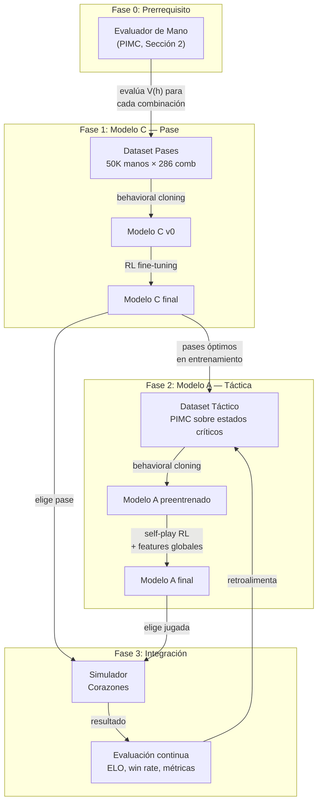

# Arquitectura Multi-Modelo con MCTS para Corazones

**Fecha:** 2026-06-12
**Tipo:** Documento de Arquitectura (ADR — Architecture Decision Record)
**Motivación:** Superar las limitaciones de un solo modelo PPO para alcanzar nivel de juego superior al humano, aprovechando MCTS para generación de datasets de entrenamiento especializados.
**Alcance:** Cambio de arquitectura global respecto a los documentos 0-5.

---

## 1. Visión General

### 1.1 Problema que resolvemos

Un solo modelo PPO, incluso con features estratégicas y reward shaping, enfrenta límites fundamentales:

1. **Credit assignment diluido:** La recompensa terminal llega después de ~52 decisiones (13 bazas × 4 jugadores). La señal se diluye.
2. **Eventos raros:** El *shooting the moon* ocurre en <5% de las manos. PPO apenas lo practica.
3. **Exploración ineficiente:** PPO explora por muestreo estocástico de la política. Descubrir que "pasar la Q♠ al jugador de la izquierda cuando tiene pocas picas" requiere millones de episodios.

### 1.2 Solución propuesta

Una arquitectura híbrida que combina:

```
┌─────────────────────────────────────────────────────────────┐
│                     MCTS (offline)                           │
│  Genera datasets de "jugada experta" usando simulaciones     │
│  con información perfecta + determinización (PIMC).          │
└──────────┬──────────┬──────────┬────────────────────────────┘
           │          │          │
           ▼          ▼          ▼
     ┌─────────┐ ┌─────────┐ ┌─────────────┐
     │Modelo C │ │Modelo A │ │Modelo B      │
     │  Pase   │ │ Táctica │ │(Features en  │
     │  (Nuevo)│ │(Refinado)│ │ Modelo A)    │
     └─────────┘ └─────────┘ └─────────────┘
           │          │          │
           └──────────┼──────────┘
                      ▼
              ┌──────────────┐
              │  Simulador   │
              │  Corazones   │
              │  (Módulo 1)  │
              └──────────────┘
```

**Principio clave:** MCTS no se usa en tiempo real (inferencia). Se usa **offline** para generar datos de entrenamiento de altísima calidad. Los modelos aprenden por *behavioral cloning* + fine-tuning con RL.

---

## 2. El Componente Central: Evaluador de Mano vía MCTS

Antes de construir cualquier modelo especializado, necesitamos un **evaluador de calidad de mano**. Este es el prerrequisito fundamental.

### 2.1 ¿Qué es "evaluar una mano"?

Dada una configuración inicial de 13 cartas para un jugador (y conocimiento parcial de las otras 39), queremos responder:

> **¿Cuál es el puntaje esperado que este jugador obtendrá en esta ronda, asumiendo juego óptimo de todos los participantes?**

Formalmente, si $h$ es la mano del jugador, buscamos:

$$V(h) = \mathbb{E}_{c_{-h} \sim \text{reparto consistente}}\left[\min_{\pi} \sum_{\text{bazas}} \text{puntos}(\text{baza}) \mid h, c_{-h}\right]$$

Donde $c_{-h}$ son las cartas de los otros 3 jugadores, muestreadas de todas las configuraciones consistentes con $h$ y el cementerio conocido.

### 2.2 PIMC (Perfect Information Monte Carlo) para evaluación de mano

El algoritmo para evaluar $V(h)$:

```python
def evaluar_mano(mano_13_cartas: list[Carta], num_mundos: int = 500) -> float:
    """
    Estima el puntaje esperado de una mano usando PIMC.
    
    Args:
        mano_13_cartas: Las 13 cartas iniciales del jugador.
        num_mundos: Número de configuraciones de cartas rivales a muestrear.
    
    Returns:
        Puntaje esperado (0 = perfecto, 26 = desastre total).
    """
    puntajes = []
    
    for _ in range(num_mundos):
        # 1. GENERAR MUNDO: repartir las 39 cartas restantes entre 3 rivales
        cartas_restantes = [c for c in Carta._TODAS if c not in mano_13_cartas]
        random.shuffle(cartas_restantes)
        rivales = [
            cartas_restantes[0:13],
            cartas_restantes[13:26],
            cartas_restantes[26:39],
        ]
        
        # 2. SIMULAR: jugar la ronda completa con MCTS para CADA jugador
        #    (o con una política experta como aproximación)
        resultado = simular_ronda_con_mcts(mano_13_cartas, rivales)
        puntajes.append(resultado.puntos_jugador)
    
    return np.mean(puntajes), np.std(puntajes)  # media y desviación estándar
```

### 2.3 ¿Qué tan costoso es?

| Parámetro | Valor |
|---|---|
| Mundos a muestrear | 100-500 |
| Simulaciones MCTS por mundo | 200-1000 |
| Estados explorados por simulación | ~52 |
| Total estados evaluados por mano | 100 × 500 × 52 = **~2.6M estados** |
| Tiempo estimado por mano (CPU) | 30-120 segundos |
| Tiempo para dataset de 10K manos | 80-330 horas |

**Optimización clave:** En lugar de MCTS completo para cada mundo, se puede usar una **política experta aproximada** (el modelo actual + heurísticos) como *rollout policy* de MCTS, acelerando 10-50×.

### 2.4 Casos de uso del evaluador de mano

| Caso | Descripción | Fórmula |
|---|---|---|
| **Mano sin pase** | Evaluar las 13 cartas iniciales (ronda 4, sin pase) | $V(h_{inicial})$ |
| **Mano post-pase** | Evaluar después de pasar 3 y recibir 3 | $V(h_{post-pase})$ |
| **Calidad del pase** | Diferencia entre mano post-pase y pre-pase | $\Delta V = V(h_{post}) - V(h_{pre})$ |
| **Mejor pase** | De las $\binom{13}{3}=286$ opciones, cuál maximiza $V$ | $\arg\max_{p \in \text{pases}} V(h \setminus p_{out} \cup p_{in})$ |

---

## 3. Modelo C: Pase de Cartas (Primer modelo a construir)

### 3.1 Justificación

El pase es el modelo más rentable para empezar:

- **Espacio de acción pequeño:** $\binom{13}{3} = 286$ combinaciones.
- **Evaluación independiente:** La calidad de un pase se puede medir sin depender de los otros modelos.
- **Impacto alto:** Un buen pase convierte una mano mala en jugable. Es la decisión de mayor impacto en toda la ronda.
- **Validación del pipeline:** Si MCTS→dataset→modelo funciona aquí, sabes que la metodología escala.

### 3.2 Generación del dataset de pases

```python
def generar_dataset_pases(num_manos: int = 50_000) -> list[dict]:
    """
    Genera un dataset de (mano_inicial, mejor_pase, calidad_delta).
    
    Para cada mano:
      1. Repartir 13 cartas aleatorias
      2. Evaluar V(mano_inicial) con PIMC
      3. Para cada uno de los 286 pases posibles:
         a. Simular qué 3 cartas se recibirían (asumiendo distribución
            aleatoria de las 39 restantes entre 3 rivales)
         b. Calcular V(mano_post_pase) con PIMC
      4. Guardar el pase que maximiza V(mano_post_pase) - V(mano_inicial)
    """
    dataset = []
    for i in range(num_manos):
        mano = repartir_13_cartas()
        v_base = evaluar_mano(mano)  # referencia sin pase
        
        mejor_pase = None
        mejor_delta = -float('inf')
        
        for pase in generar_pases_posibles(mano, 3):
            mano_post = simular_pase(mano, pase)
            v_post = evaluar_mano(mano_post)
            delta = v_post - v_base
            
            if delta > mejor_delta:
                mejor_delta = delta
                mejor_pase = pase
        
        dataset.append({
            "mano": mano,
            "mejor_pase": mejor_pase,
            "delta_calidad": mejor_delta,
            "v_base": v_base,
            "v_post": v_post,
        })
    return dataset
```

### 3.3 Arquitectura del Modelo C

```
Input:  52-dim (one-hot de las 13 cartas en mano)
        + 4-dim (puntajes históricos / 100)
        + 1-dim (dirección del pase: -1 izq, 0 frente, +1 der)
        = 57 dimensiones

Red:    MLP [128, 64, 32] → 286 neuronas de salida
        (una por cada combinación de 3 cartas a pasar)

Salida: Distribución de probabilidad sobre las 286 combinaciones
        (Softmax). Se selecciona la de mayor probabilidad.
```

**Alternativa más simple:** Embeddings por carta + attention sobre la mano:

```
Input:  13 × 8-dim (embedding de cada carta: palo, valor, puntos)
        + contexto global
        → Transformer Encoder ligero (2 capas, 4 heads)
        → Clasificador de 286 clases
```

### 3.4 Entrenamiento del Modelo C

**Fase 1 — Behavioral Cloning (supervisado):**

```python
# Dataset: 50K ejemplos (mano → mejor_pase)
modelo_c = EntrenarClasificador(
    X=dataset.manos,        # (50000, 57)
    y=dataset.mejor_pase,   # (50000,) → clase 0-285
    loss=CrossEntropyLoss,
    epochs=50
)
```

**Fase 2 — Fine-tuning con RL:**

```python
# Usar PPO con el modelo preentrenado como política inicial
# El entorno es: recibir mano → elegir pase → jugar ronda completa
# Recompensa: -puntos_obtenidos_en_ronda
modelo_c_rl = PPO(
    policy=modelo_c.policy,  # inicializado con behavioral cloning
    env=EntornoPase,
    n_steps=1_000_000
)
```

---

## 4. Modelo A: Táctica por Ronda (Refinamiento del modelo actual)

### 4.1 Objetivo

El modelo actual (MaskablePPO, 190 dims) ya juega razonablemente bien. El objetivo NO es reemplazarlo, sino **refinarlo** con datos de MCTS para que alcance nivel experto.

### 4.2 Generación de dataset táctico con PIMC

Para cada estado del juego, PIMC genera la "jugada óptima":

```python
def pimc_mejor_jugada(estado: EstadoJuego, num_mundos: int = 100) -> Carta:
    """
    Encuentra la mejor jugada para el jugador actual usando PIMC.
    
    Args:
        estado: Estado actual del juego (mano, mesa, cementerio, voids, puntajes).
        num_mundos: Mundos a muestrear para determinización.
    
    Returns:
        La carta que minimiza el puntaje esperado.
    """
    legales = estado.jugadas_legales()
    puntaje_esperado = {}
    
    for carta in legales:
        total_puntos = 0.0
        for _ in range(num_mundos):
            # 1. Completar el mundo (muestrear cartas desconocidas)
            mundo = determinizar(estado)
            # 2. Simular desde este estado jugando 'carta'
            resultado = mcts_desde_estado(mundo, primera_accion=carta)
            total_puntos += resultado.puntos_jugador
        puntaje_esperado[carta] = total_puntos / num_mundos
    
    return min(puntaje_esperado, key=puntaje_esperado.get)
```

### 4.3 Cuándo ejecutar MCTS

No todos los estados requieren MCTS. Clasificamos:

| Tipo de estado | % de bazas | ¿MCTS? | Estrategia |
|---|---|---|---|
| **Trivial** (solo 1 legal) | ~5% | No | La única legal |
| **Fácil** (fugar sin riesgo) | ~30% | No | Heurístico rápido |
| **Intermedio** | ~50% | **Sí** | PIMC con 100 mundos |
| **Crítico** (Q♠ en juego, pozo posible) | ~15% | **Sí** | PIMC con 500 mundos |

Esto reduce el costo total en ~60%.

### 4.4 Arquitectura del Modelo A refinado

**Misma arquitectura que el actual** (MLP [256, 256, 128]), pero con:

- **Más dimensiones de entrada** (194 con all_void, o más)
- **Preentrenamiento supervisado** con el dataset MCTS (behavioral cloning)
- **Fine-tuning RL** con self-play contra snapshots históricos

---

## 5. Modelo B: Estrategia Global (Features, no modelo separado)

### 5.1 Por qué NO es un modelo separado

Después de análisis detallado, el "modelo de partida global" **no debe ser un modelo independiente**. Razones:

1. **Estado pequeño y discreto:** La partida global se resume en 4 puntajes (0-100) + ronda actual. Esto es un MDP con ~100⁴ estados, resoluble con enfoques tabulares.
2. **Acoplamiento fuerte:** La decisión de "arriesgarse o no" solo tiene sentido en el contexto de qué cartas tienes AHORA. Separarlo crea un problema de coordinación innecesario.
3. **Las features existentes ya lo codifican:** `pozo_viable`, `debo_arriesgar`, `puedo_alimentar` + puntajes históricos en la observación le dan al Modelo A TODO el contexto global que necesita.

### 5.2 Lo que SÍ se puede mejorar

En lugar de un modelo separado, se agregan **features de contexto global** más ricas al Modelo A:

| Feature | Descripción | Dimensión |
|---|---|---|
| `pozo_viable` | ¿Puedo hacer pozo? | 1 |
| `debo_arriesgar` | ¿Estoy perdiendo y debo arriesgar? | 1 |
| `puedo_alimentar` | ¿Puedo hundir a un rival? | 1 |
| `all_void_X` | ¿Todos los rivales son void en palo X? | 4 |
| `diferencia_lider` | Distancia en puntos al 1º lugar (/100) | 1 |
| `diferencia_ultimo` | Distancia en puntos al 4º lugar (/100) | 1 |
| `jugadores_cerca_100` | ¿Hay ≥1 jugador a ≤15 pts de perder? | 1 |
| `rondas_restantes_estimadas` | ~(400 - sum(puntajes)) / 26, normalizado | 1 |
| `modo_pase_actual` | Dirección del pase esta ronda (one-hot 4) | 4 |

**Total:** +15 features → 209 dimensiones (194 + 15).

---

## 6. Pipeline Completo



---

## 7. Plan de Implementación por Fases

### Fase 6 (AHORA — 1-2 días)

- [ ] Implementar `all_void` (features 190-193) → 194 dimensiones
- [ ] Actualizar `entorno.py`, `entorno_multi.py`, `asesor_carta.py`, `train_self_play.py`
- [ ] Transferencia de pesos 190→194 con padding de ceros
- [ ] Reentrenar y evaluar (comparar transferencia vs desde cero)
- **DoD:** Tests pasan. El modelo no tira Q♠ en escenarios documentados.

### Fase 7 — Evaluador de Mano PIMC (3-5 días)

- [ ] Implementar `evaluar_mano()` con PIMC (Sección 2)
- [ ] Optimizar con política *rollout* heurística para reducir costo 10-50×
- [ ] Validar: evaluar 100 manos conocidas, verificar que $V(h)$ correlaciona con puntaje real
- [ ] Generar dataset pequeño (~1000 manos) para validación del pipeline
- **DoD:** El evaluador asigna puntajes consistentes (manos obviamente buenas → V bajo, manos obviamente malas → V alto).

### Fase 8 — Modelo C: Pase de Cartas (5-10 días)

- [ ] Generar dataset de 10K-50K manos con mejor pase vía PIMC
- [ ] Implementar arquitectura del Modelo C (MLP o Transformer ligero)
- [ ] Entrenar con behavioral cloning
- [ ] Fine-tuning RL en entorno de pase
- [ ] Evaluar: win rate del modelo CON pase entrenado vs pase heurístico
- **DoD:** El modelo de pase supera al heurístico "pasar las 3 peores cartas" en ≥60% de las manos.

### Fase 9 — Refinamiento del Modelo A (7-14 días)

- [ ] Generar dataset táctico con PIMC en estados críticos (~100K ejemplos)
- [ ] Preentrenar Modelo A con behavioral cloning sobre dataset MCTS
- [ ] Agregar features de contexto global (+15 dims → 209 total)
- [ ] Fine-tuning RL con self-play + pases del Modelo C
- [ ] Evaluar contra humanos y solitar.io
- **DoD:** El modelo supera consistentemente a jugadores humanos intermedios (≥2º lugar en solitar.io difícil).

---

## 8. Riesgos y Mitigaciones

| Riesgo | Probabilidad | Impacto | Mitigación |
|---|---|---|---|
| PIMC demasiado lento para dataset grande | Alta | Medio | Usar política *rollout* (modelo actual) en lugar de MCTS completo; priorizar solo estados críticos (Sección 4.3) |
| Dataset MCTS de baja calidad (errores sistemáticos) | Media | Alto | Validación cruzada: comparar decisiones MCTS vs jugadores humanos expertos en 100 escenarios |
| Behavioral cloning no transfiere bien a RL | Media | Medio | Usar DAGGER (Dataset Aggregation): alternar recolección de datos con la política actual y reentrenamiento |
| Modelo C no mejora significativamente sobre heurístico | Media | Bajo | Aceptar y pasar a Fase 9. El pase heurístico ya cubre ~80% del valor óptimo |
| Overfitting al dataset MCTS | Baja | Alto | El dataset debe cubrir diversidad de situaciones. Augmentar con permutaciones de palos y posiciones |

---

## 9. Preguntas Abiertas para Decidir

| # | Pregunta | Opciones |
|---|---|---|
| 1 | ¿Arrancamos Fase 6 (all_void) YA, o preferís seguir discutiendo la arquitectura? | **Recomiendo:** Arrancar Fase 6 ya. Es 1-2 días y no interfiere con el plan multi-modelo |
| 2 | ¿Qué tamaño de dataset inicial para MCTS de pase? | 1K (validación), 10K (mínimo viable), 50K (recomendado) |
| 3 | ¿Usar el modelo actual como política *rollout* del MCTS o hacer MCTS puro? | **Recomiendo:** modelo actual como *rollout*. 10-50× más rápido, suficiente para generar datasets |
| 4 | ¿Priorizar pase (Modelo C) o táctica (Modelo A refinado) primero? | **Recomiendo:** Pase primero (Fase 8). Es más acotado, valida el pipeline, y sus beneficios se acumulan al Modelo A |
| 5 | ¿El Modelo A refinado reemplaza al actual o es un modelo nuevo desde cero? | **Recomiendo:** Refinamiento del actual (misma arquitectura, preentrenado con behavioral cloning, fine-tuned con RL) |

---

## 10. Notas Técnicas

### 10.1 Sobre la determinización en PIMC

Cuando muestreamos mundos para PIMC, debemos respetar la información CONOCIDA:

- **Cartas vistas:** Las que están en el cementerio NO pueden estar en manos rivales.
- **Voids conocidos:** Si sabemos que J2 es void en tréboles, no le asignamos tréboles.
- **Restricción de la primera baza:** Nadie puede jugar puntos en la baza 1 a menos que no tenga alternativa.

```python
def determinizar(estado: EstadoJuego) -> EstadoJuego:
    """Completa un estado de información imperfecta a información perfecta."""
    cartas_desconocidas = set(Carta._TODAS) - estado.cartas_conocidas()
    
    # Distribuir respetando voids conocidos
    for rival in range(3):
        cartas_rival = []
        for palo in range(4):
            if palo in estado.vacios[rival]:
                continue  # este rival es void en este palo
            # Asignar cartas de este palo proporcionalmente
            ...
    
    return estado_completado
```

### 10.2 Sobre la evaluación sin pase (ronda 4)

En la cuarta ronda de cada ciclo, no hay pase de cartas. Para evaluar $V(h)$ en este caso:

```python
# Es exactamente el mismo evaluador de mano, pero sin modificar la mano
v_mano_ronda4 = evaluar_mano(mano_inicial_13_cartas)
```

No hay diferencia metodológica — el evaluador de la Sección 2 ya maneja ambos casos.

### 10.3 Sobre la sinergia entre modelos

El Modelo C (pase) y el Modelo A (táctica) NO necesitan "comunicarse" en tiempo real:

1. **Modelo C** decide el pase ANTES de que empiece la ronda.
2. **Modelo A** recibe la mano post-pase como input (las 13 cartas que le quedaron).
3. El contexto global (puntajes, voids, etc.) viene codificado en las features del Modelo A.

La "comunicación" ocurre a través del estado del juego, no mediante un protocolo explícito entre modelos.

---

## 11. Referencias

- Cowling, P. I., Powley, E. J., & Whitehouse, D. (2012). Information Set Monte Carlo Tree Search. *IEEE Transactions on Computational Intelligence and AI in Games*.
- Silver, D. et al. (2017). Mastering Chess and Shogi by Self-Play with a General Reinforcement Learning Algorithm. *arXiv:1712.01815*. (AlphaZero)
- Sutton, R. S., Precup, D., & Singh, S. (1999). Between MDPs and Semi-MDPs: A Framework for Temporal Abstraction in Reinforcement Learning. *Artificial Intelligence*.

---

**Documento creado:** 2026-06-12
**Próximo paso:** Decidir si arrancar Fase 6 (all_void) o continuar refinando este diseño.
