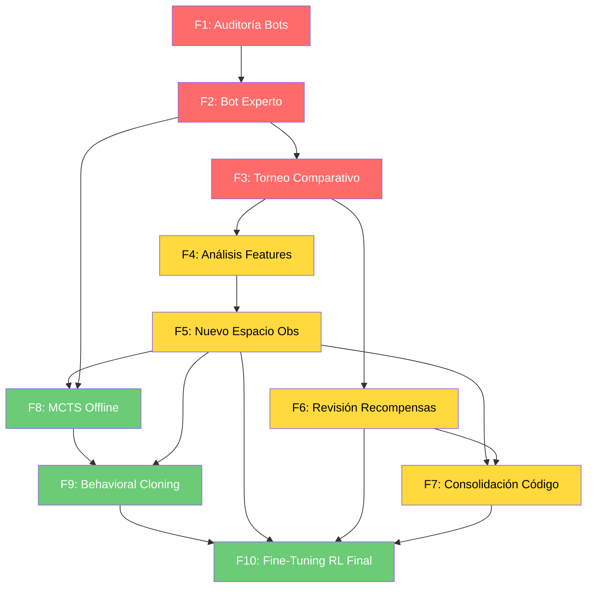

# Plan de Reorganización y Mejora — CorazonesRL v2.0

**Fecha:** 2026-06-13
**Objetivo:** Reorganizar el proyecto, construir oponentes competentes (bots + sistema experto), refinar el espacio de observación y recompensas, y entrenar un modelo que supere consistentemente a jugadores humanos.
**Principio rector:** Ir paso a paso. Probar cada paso antes de avanzar al siguiente. No modificar parámetros hasta tener claro qué features se necesitan.

---

## 📋 Resumen Ejecutivo

| # | Fase | Prioridad | Esfuerzo | Estado |
|---|---|---|---|---|
| 1 | Auditoría y testing de bots actuales | 🔴 ALTA | 1 día | ⬜ Pendiente |
| 2 | Bot Experto (sistema de reglas) | 🔴 ALTA | 3-5 días | ⬜ Pendiente |
| 3 | Torneo: Bot Experto vs bots actuales vs modelo RL | 🔴 ALTA | 1 día | ⬜ Pendiente |
| 4 | Análisis: ¿qué features necesita el modelo? | 🟡 MEDIA | 1 día | ⬜ Pendiente |
| 5 | Nuevo espacio de observación definitivo | 🟡 MEDIA | 2 días | ⬜ Pendiente |
| 6 | Revisión de recompensas | 🟡 MEDIA | 2 días | ⬜ Pendiente |
| 7 | Consolidación de código (limpieza) | 🟡 MEDIA | 2 días | ⬜ Pendiente |
| 8 | MCTS offline con Bot Experto como rollout | 🟢 BAJA | 5-10 días | ⬜ Pendiente |
| 9 | Preentrenamiento supervisado (behavioral cloning) | 🟢 BAJA | 3-5 días | ⬜ Pendiente |
| 10 | Fine-tuning RL con nuevo entorno | 🟢 BAJA | 7-14 días | ⬜ Pendiente |

---

## 🗑️ Qué ELIMINAR o ARCHIVAR

| Elemento | Acción | Razón |
|---|---|---|
| `modelos_historicos/v2/` | 📦 Archivar (mover a `_archivo_v1_v2/`) | Obsoleto, 187 dims |
| `modelos_historicos/v5/` | 📦 Archivar | 190 dims, superado por v6 |
| `vecnormalize/v5/` | 📦 Archivar | Consistente con modelos v5 |
| `vecnormalize/v6/` | 📦 Archivar | Se recreará con el nuevo espacio |
| `logs/MaskablePPO_0/` | 📦 Archivar o eliminar | Logs de entrenamientos viejos |
| `4_Plan_Mejora_Estrategica.md` | 📄 Consolidar en este documento | Información ya absorbida aquí |
| `5_Plan_Fase6_AllVoid.md` | 📄 Consolidar en este documento | Idem |
| `6_Arquitectura_MultiModelo_MCTS.md` | 📄 Consolidar en este documento | Idem |
| `INSTRUCCIONES.md` | ✏️ Reescribir al final | Muy desactualizado |
| `train_self_play.py` — funciones `_v2`, `_v5` | 🗑️ Eliminar | Duplicación, solo debe quedar una |
| `train_self_play.py` — función `crear_entorno_self_play` original | 🗑️ Eliminar | Usa directorio viejo sin versión |
| `src/entorno_multi.py` | 🤔 Evaluar si se usa | Posiblemente redundante con `src/entorno.py` |

## ✅ Qué CONSERVAR (reutilizable)

| Elemento | Estado | Notas |
|---|---|---|
| `src/carta.py` | ✅ Sólido | Sin cambios necesarios |
| `src/baraja.py` | ✅ Sólido | Sin cambios necesarios |
| `src/jugador.py` | ✅ Sólido | Sin cambios necesarios |
| `src/motor.py` | ✅ Sólido | Sin cambios necesarios |
| `src/entorno.py` | 🔧 Refactorizar | Buena estructura, requiere nuevos features y recompensas |
| `src/red.py` | 🔧 Ajustar | Arquitectura MLP OK, cambiar `input_dim` y `features_dim` |
| `src/bots.py` | 🔧 Extender | Conservar los 3 bots simples como baseline, agregar Bot Experto |
| `src/elo_torneo.py` | ✅ Sólido | Sin cambios necesarios |
| `src/evaluacion.py` | 🔧 Actualizar | Agregar evaluación contra Bot Experto |
| `train_auto_v6.py` | 🔧 Refactorizar | Excelente infraestructura, adaptar al nuevo espacio |
| `tests/` (tests de motor) | ✅ Sólido | Sin cambios necesarios |
| `tests/` (tests de entorno) | 🔧 Actualizar | Nuevos asserts para nuevo espacio de observación |
| `test_stress.py` | ✅ Sólido | Sin cambios necesarios |
| `modelos_historicos/v6/` | 📦 Mantener como referencia | No son el punto de partida para el nuevo entrenamiento |
| `modelos_historicos/golden_v7/` | 📦 Mantener como referencia | Mejor modelo histórico (1723 Elo), referencia de calidad |

---

---

# 🔴 FASE 1: Auditoría y Testing de Bots Actuales

> **Objetivo:** Entender con precisión qué tan malos son los bots actuales.
> **No se modifica nada todavía.** Solo se evalúa y documenta.

## 1.1 Pruebas a ejecutar

### Test A: Win rate entre bots (todos contra todos)

```powershell
# Torneo Elo solo con los 3 bots
python -m src.elo_torneo --directorios modelos_historicos/v6 --partidas 50 --elo-puro --incluir-bots
```

Queremos responder:
- ¿Cuál es el Elo relativo de cada bot?
- ¿El bot evasivo realmente es mejor que el conservador?
- ¿Hay un bot claramente dominante?

### Test B: Análisis manual de partidas bot vs bot

```powershell
# Jugar 10 partidas bot vs bot, registrando cada decisión
python -m src.evaluacion --ruta BOTS_ONLY --partidas 10 --verbose
```

Para cada baza, anotar:
- ¿El bot tenía una jugada obviamente mejor que no eligió?
- ¿Cometió errores de "regalar puntos sin necesidad"?
- ¿Tomó decisiones que un humano intermedio jamás tomaría?

### Test C: Win rate del mejor modelo RL vs bots

```powershell
# v7_14.9M (1723 Elo) vs los 3 bots
python evaluar_modelo.py --modelo modelos_historicos/golden_v7/snapshot_0014900000.zip --partidas 200
```

### Test D: El modelo RL vs Bot Experto (cuando esté listo en Fase 2)

Este test se ejecuta después de la Fase 2.

## 1.2 Documentar deficiencias encontradas

Crear un archivo `observaciones_bots.md` con:
- Errores sistemáticos detectados
- Situaciones donde los bots son predecibles
- Debilidades que el modelo RL está explotando (sin realmente aprender Corazones)

## 1.3 DoD (Definition of Done)

- [ ] Torneo Elo entre bots ejecutado y resultados documentados
- [ ] 10 partidas manuales analizadas y deficiencias documentadas
- [ ] Win rate del modelo RL vs bots registrado
- [ ] `observaciones_bots.md` creado

---

---

# 🔴 FASE 2: Bot Experto — Sistema Basado en Reglas

> **Objetivo:** Construir un bot que juegue Corazones "bien" usando solo reglas lógicas.
> **Sin redes neuronales.** Pura inferencia y heurística.

## 2.1 Arquitectura del Bot Experto

```
BotExperto(cartas_conocidas, voids, puntajes, baza_numero)
├── Fase 1: Conteo de cartas
│   ├── cartas_restantes_por_palo() → {0: n, 1: n, 2: n, 3: n}
│   ├── cartas_altas_restantes(palo) → cuántas J/Q/K/A quedan
│   └── palos_seguros_para_liderar() → palos donde todos son void
│
├── Fase 2: Inferencia de Q♠
│   ├── probabilidad_q_spades_por_jugador() → [p0, p1, p2, p3]
│   ├── Actualización bayesiana cada vez que se juega una pica
│   └── Reglas:
│       - Jugador no sigue picas → void en picas → prob=0 para ese jugador
│       - Jugador juega pica alta (A, K) → probablemente no tiene Q♠
│       - Jugador juega pica baja → podría estar escondiendo Q♠
│
├── Fase 3: Detección de modo de juego
│   ├── Modo actual: MINIMIZAR | POZO | ALIMENTAR | BLOQUEAR
│   ├── pozo_viable():
│   │   ├── ≥6 corazones en mano
│   │   ├── ≥3 corazones altos (J/Q/K/A)
│   │   ├── corazones NO rotos
│   │   └── puntaje < 85
│   ├── debo_alimentar():
│   │   └── rival_X está a ≤15 pts de perder Y yo estoy a >30 pts
│   └── debo_bloquear_pozo():
│       └── rival está acumulando muchos corazones (>10 pts en mano)
│
├── Fase 4: Decisión por baza
│   ├── Si SIGO el palo (mesa no vacía, tengo cartas del palo):
│   │   ├── POZO: jugar la más alta para ganar la baza
│   │   ├── MINIMIZAR: jugar la más baja (idealmente menor que la actual ganadora)
│   │   ├── ALIMENTAR: depende del rival objetivo
│   │   └── BLOQUEAR: jugar carta que gane la baza (evitar que el rival capture)
│   │
│   ├── Si estoy VOID (no tengo cartas del palo de salida):
│   │   ├── Prioridad de descarte: Q♠ > Corazones altos > Corazones bajos > Picas altas > basura
│   │   ├── Si la baza NO tiene puntos → descartar basura
│   │   └── Si la baza TIENE puntos → NO descartar Q♠ ni corazones (a menos que sea seguro)
│   │
│   └── Si LIDERO (mesa vacía):
│       ├── Preferir palo donde soy void (fuga asegurada)
│       ├── Preferir palo donde tengo cartas bajas
│       ├── Evitar palo donde solo tengo Q♠ o corazones altos
│       └── Si quedan ≤3 cartas del palo → más seguro liderarlo
│
└── Fase 5: Planificación multi-baza (lookahead simple)
    ├── "Si lidero picas ahora, ¿me pueden devolver la Q♠?"
    ├── "¿Cuántas bazas me quedan para descartar corazones?"
    └── "Si gano esta baza, ¿puedo liderar un palo seguro la siguiente?"
```

## 2.2 Implementación TDD

### Paso 1: Tests para conteo de cartas

```powershell
# Archivo: tests/test_bot_experto.py
```

Tests:
- `test_cartas_restantes_por_palo_inicial` — al inicio, 13 por palo
- `test_cartas_restantes_por_palo_despues_de_baza` — después de una baza, descuenta correctamente
- `test_cartas_altas_restantes` — detecta J/Q/K/A restantes
- `test_palos_seguros_para_liderar` — si todos son void en tréboles, es seguro

### Paso 2: Tests para inferencia de Q♠

- `test_q_probabilidad_inicial` — al inicio, 25% cada jugador
- `test_q_probabilidad_jugador_void_en_picas` — si no sigue picas, prob=0
- `test_q_probabilidad_jugador_juega_pica_alta` — reduce probabilidad
- `test_q_probabilidad_jugador_juega_pica_baja` — aumenta probabilidad
- `test_q_probabilidad_q_spades_capturada` — cuando se captura, certeza 100%

### Paso 3: Tests para modos de juego

- `test_pozo_viable_true` — 7 corazones, 3 altos, no rotos → True
- `test_pozo_viable_false_corazones_rotos` — 💔 → False
- `test_pozo_viable_false_pocos_corazones` — solo 3 corazones → False
- `test_debo_alimentar` — rival a 90 pts, yo a 50 → True
- `test_debo_bloquear_pozo` — rival acumuló 15 pts en corazones → True

### Paso 4: Tests para decisión por baza

- `test_seguir_palo_minimizar` — jugar la más baja del palo
- `test_seguir_palo_pozo` — jugar la más alta, ganar la baza
- `test_void_descartar_q_spades` — si es seguro, descartar Q♠
- `test_void_descartar_corazon_alto` — descartar A♥ cuando no hay puntos en mesa
- `test_liderar_palo_seguro` — liderar palo donde todos son void
- `test_liderar_evitar_palo_peligroso` — no liderar picas si tengo Q♠

### Paso 5: Implementación

Archivo: `src/bot_experto.py`

```python
class BotExperto:
    """Bot basado en reglas con inferencia bayesiana y planificación multi-baza."""

    def __init__(self) -> None:
        self._q_probs: List[float] = [0.25, 0.25, 0.25, 0.25]
        self._cartas_jugadas: Set[int] = set()
        # ...

    def elegir_carta(
        self, motor: MotorCorazones, jugador_idx: int, legales: List[Carta]
    ) -> Carta:
        """Elige la mejor carta según el modo de juego y el estado actual."""
        modo = self._determinar_modo(motor, jugador_idx)
        if modo == Modo.POZO:
            return self._elegir_pozo(motor, jugador_idx, legales)
        elif modo == Modo.ALIMENTAR:
            return self._elegir_alimentar(motor, jugador_idx, legales)
        elif modo == Modo.BLOQUEAR:
            return self._elegir_bloquear(motor, jugador_idx, legales)
        else:
            return self._elegir_minimizar(motor, jugador_idx, legales)
```

## 2.3 Validación cruzada

Comparar decisiones del Bot Experto contra:
- Tus propias decisiones como jugador humano (en 20 manos)
- Las decisiones del bot difícil de solitar.io (en 10 manos)

## 2.4 DoD

- [ ] Todos los tests de `tests/test_bot_experto.py` pasando
- [ ] Bot Experto implementado en `src/bot_experto.py`
- [ ] Torneo: Bot Experto gana ≥80% contra cada bot simple (conservador, agresivo, evasivo)
- [ ] Torneo: Bot Experto gana ≥60% contra el mejor modelo RL (v7_14.9M)
- [ ] 20 manos validadas contra decisiones humanas (≥80% coincidencia en decisiones razonables)

---

---

# 🔴 FASE 3: Torneo Comparativo Completo

> **Objetivo:** Medir con precisión la jerarquía de habilidad entre todos los jugadores.

## 3.1 Jugadores a evaluar

| # | Jugador | Tipo |
|---|---|---|
| 1 | Aleatorio | Baseline (25% win rate) |
| 2 | Bot Conservador | Heurístico simple |
| 3 | Bot Agresivo | Heurístico simple |
| 4 | Bot Evasivo | Heurístico simple |
| 5 | Bot Experto (Fase 2) | Sistema de reglas avanzado |
| 6 | v7_14.9M (1723 Elo) | Mejor modelo RL actual |
| 7 | v6_10M (1532 Elo) | Modelo RL de referencia |

## 3.2 Torneo

```powershell
# Torneo Elo puro con todos los jugadores
python -m src.elo_torneo --partidas 50 --elo-puro --incluir-bots --vs-experto
```

## 3.3 Métricas a recolectar por jugador

- Win rate global
- Puntos promedio por mano
- % de manos con 0 puntos
- % de veces que captura Q♠
- % de pozos (shooting the moon) exitosos
- Posición promedio (1º, 2º, 3º, 4º)

## 3.4 DoD

- [ ] Tabla de clasificación Elo generada
- [ ] Métricas detalladas por jugador documentadas
- [ ] Análisis: ¿el Bot Experto supera consistentemente al mejor modelo RL?
- [ ] Análisis: ¿qué tipo de errores comete el Bot Experto que el modelo RL no?

---

---

# 🟡 FASE 4: Análisis de Features Necesarios

> **Objetivo:** Determinar EXACTAMENTE qué features necesita el espacio de observación.
> **NO se modifica código todavía.** Solo se documenta el diseño.

## 4.1 Lo que SÍ funciona del espacio actual (194 dims)

| Bloque | Rango | ¿Se conserva? | Nota |
|---|---|---|---|
| Mano del agente | `[0:52]` | ✅ Sí | One-hot, fundamental |
| Mesa actual | `[52:104]` | ✅ Sí | One-hot, fundamental |
| Cementerio | `[104:156]` | ✅ Sí | One-hot, fundamental |
| Vacíos conocidos | `[156:172]` | ✅ Sí | 4×4, crucial para fugas |
| Puntajes históricos | `[172:176]` | ✅ Sí | /100 |
| Puntos mano actual | `[176:180]` | ✅ Sí | /26 |
| Corazones rotos | `[180]` | ✅ Sí | Booleano |
| Posición en baza | `[181]` | ✅ Sí | 0, 0.33, 0.66, 1.0 |
| Rastreador Q♠ | `[182:187]` | 🔧 Expandir | Pasar de 5 estados a vector de probabilidad |
| pozo_viable | `[187]` | ✅ Sí | Feature estratégico |
| debo_arriesgar | `[188]` | ✅ Sí | Feature estratégico |
| puedo_alimentar | `[189]` | ✅ Sí | Feature estratégico |
| all_void_X | `[190:194]` | ✅ Sí | 4 features |

## 4.2 Features NUEVOS propuestos

| Feature | Índice | Tipo | Justificación |
|---|---|---|---|
| **Número de baza / 13** | `[194]` | float | El modelo necesita saber en qué fase está |
| **Cartas restantes por palo** (4) | `[195:199]` | float /13 | Saber si liderar un palo es seguro |
| **Cartas altas restantes por palo** (4) | `[199:203]` | float /4 | planificar si puede ganar bazas futuras |
| **Probabilidad Q♠ por jugador** (4) | `[203:207]` | float [0,1] | Inferencia bayesiana como el bot difícil |
| **Modo de juego one-hot** (4) | `[207:211]` | one-hot | MINIMIZAR/POZO/ALIMENTAR/BLOQUEAR |
| **Diferencia de puntaje con líder** | `[211]` | float /100 | Adaptar estrategia según posición |
| **Diferencia con último** | `[212]` | float /100 | ¿Estoy en zona de peligro? |
| **Jugadores cerca de 100** | `[213]` | float /3 | ¿Queda poco partido? |
| **Dirección del pase** (4) | `[214:218]` | one-hot | Izq/Der/Frente/Nada |
| **% bazas restantes con puntos** | `[219]` | float | ¿Quedan muchos corazones por salir? |

**Total propuesto: ~220 dimensiones.**

## 4.3 Matriz de decisión: ¿agregar o no cada feature?

Para cada feature propuesto, responder:
1. ¿Puede el modelo inferir esto de los datos existentes? Si es fácil → quizás no hace falta.
2. ¿Es una combinación no lineal de features existentes? Si es difícil de aprender → agregarlo.
3. ¿Aporta información que un humano usaría? Si un humano lo considera → el modelo también debería.

**Ejemplo de decisión:**
- `all_void_X`: el modelo TIENE los voids individuales, pero la combinación "todos son void" requiere aprender una regla combinatoria. **Se agregó en v6 y fue correcto.**
- `número de baza / 13`: el modelo podría inferirlo del tamaño del cementerio, pero es una división trivial que consume capacidad de aprendizaje. **Vale la pena agregarlo.**
- `cartas restantes por palo`: se puede inferir de `[0:52] + [104:156]`, pero requiere conteo. El modelo PUEDE aprenderlo pero desperdicia capacidad. **Vale la pena agregarlo.**

## 4.4 DoD

- [ ] Matriz de decisión completada para cada feature propuesto
- [ ] Espacio de observación definitivo documentado (lista de índices y significados)
- [ ] Dimensión final confirmada (estimada ~220)

---

---

# 🟡 FASE 5: Nuevo Espacio de Observación (Implementación)

> **Objetivo:** Modificar `src/entorno.py` y archivos relacionados para el nuevo espacio.
> **Solo se implementa después de la Fase 4.**

## 5.1 Archivos a modificar

| Archivo | Cambio |
|---|---|
| `src/entorno.py` | `observation_space = Box(..., shape=(220,))`, `_construir_observacion()` actualizado |
| `src/entorno_multi.py` | Mismos cambios que `entorno.py` |
| `src/red.py` | `input_dim = 220`, ajustar `features_dim` si es necesario |
| `src/asesor_carta.py` | Actualizar `construir_observacion_parcial()` |
| `train_self_play.py` | `PoliticaSB3._construir_obs_desde_motor()` actualizado |
| `tests/test_modulo2.py` | Actualizar asserts de dimensiones |
| `tests/test_modulo3.py` | Actualizar asserts de dimensiones |
| `tests/test_entorno_v5.py` | Actualizar asserts de dimensiones |
| `tests/test_asesor.py` | Actualizar asserts de dimensiones |
| `tests/test_entorno_v7.py` | **Nuevo** — tests específicos para nuevos features |

## 5.2 Tests (TDD: primero tests, luego implementación)

### `tests/test_entorno_v7.py`

```python
def test_observacion_dimension_220():
    """El vector de observación debe tener exactamente 220 dimensiones."""
    env = CorazonesEnv()
    obs, _ = env.reset(seed=42)
    assert obs.shape == (220,)

def test_feature_numero_baza():
    """El feature [194] debe reflejar el número de baza actual / 13."""
    ...

def test_feature_cartas_restantes_por_palo():
    """Al inicio debe ser [13,13,13,13]/13 = [1,1,1,1]."""
    ...

def test_feature_prob_q_spades():
    """Al inicio, Q♠ debe tener probabilidad uniforme entre los rivales."""
    ...

def test_feature_modo_juego_onehot():
    """Al inicio sin condiciones especiales, modo debe ser MINIMIZAR."""
    ...

def test_feature_diferencia_lider():
    """Al inicio de partida, diferencia con líder debe ser 0."""
    ...
```

## 5.3 DoD

- [ ] Todos los tests de `test_entorno_v7.py` pasando
- [ ] Tests existentes actualizados y pasando
- [ ] `env_checker` pasa con el nuevo espacio
- [ ] Validación visual: imprimir vector de los primeros 5 pasos, verificar rangos [0,1] y sin NaN

---

---

# 🟡 FASE 6: Revisión de Recompensas

> **Objetivo:** Rediseñar el sistema de recompensas basado en el aprendizaje de la Fase 3.
> **Solo se modifica después de tener el Bot Experto y el torneo comparativo.**

## 6.1 Principios de diseño

1. **La recompensa terminal es la señal dominante.** (+500/ +200/ -200/ -500). No se toca.
2. **Recompensas densas solo donde realmente importan.** No rewards shaping en bazas tempranas.
3. **Las recompensas deben escalar con la fase de juego.**
4. **No recompensar "no hacer nada malo" en bazas donde es imposible hacer algo malo.**

## 6.2 Recompensas propuestas

```python
# === SE MANTIENEN (ya eran correctas) ===
REWARD_CORAZON = -1.0              # Por cada corazón capturado
REWARD_DAMA_PICAS = -10.0          # Por capturar Q♠
REWARD_SHOOTING_MOON = 50.0        # Por hacer pozo exitoso
REWARD_PRIMERO = 500.0             # Ganar partida
REWARD_SEGUNDO = 200.0
REWARD_TERCERO = -200.0
REWARD_CUARTO = -500.0
REWARD_Q_SPADES_SIN_POZO = -10.0   # Penalización fuerte (era -8.0)

# === NUEVAS / MODIFICADAS ===

# Ya NO se recompensa "no ganar baza con puntos" genéricamente.
# En su lugar, se recompensa SOLO en bazas tardías (≥9):
REWARD_NO_GANAR_BAZA_CON_PUNTOS_TARDIA = 1.5  # Solo baza >= 9 y puntos > 0

# Descartar Q♠ seguro: SOLO cuando realmente es seguro (quedan ≤2 picas)
REWARD_DESCARTAR_DAMA_SEGURO = 5.0

# Descartar corazón en baza tardía: SOLO cuando es arriesgado (quedan ≤3 del palo)
REWARD_DESCARTAR_CORAZON_TARDIO = 1.5

# Ganar baza sin puntos en fase tardía: pequeña penalización por perder control
REWARD_GANAR_BAZA_SIN_PUNTOS_TARDIA = -0.5  # Solo baza >= 9

# === NUEVAS: Recompensas estratégicas ===

# Bloquear pozo ajeno: última baza donde evitas que un rival capture el último corazón
REWARD_BLOQUEAR_POZO = 15.0

# Alimentar exitosamente: el rival objetivo recibe puntos que lo acercan a 100
REWARD_ALIMENTAR_EXITOSO = 10.0

# Pozo exitoso (alternativa más frecuente): cada corazón capturado en modo pozo
REWARD_CORAZON_POZO = 1.5  # Positivo! En modo pozo, capturar corazones es BUENO

# Penalización suave por punto en mano (se mantiene pero más suave)
REWARD_POR_PUNTO_EN_MANO = -0.1  # Era -0.2
```

## 6.3 Regla de activación por fase

```python
def _es_baza_tardia(self) -> bool:
    """Las recompensas densas solo se activan en bazas 9-13."""
    return self.motor.numero_baza >= 9

def _es_baza_temprana(self) -> bool:
    """En bazas 1-4, virtualmente no hay recompensas densas."""
    return self.motor.numero_baza <= 4
```

La intuición detrás de esto:
- **Baza 1-4:** El juego está abierto. Es casi imposible predecir quién se comerá puntos. Cualquier recompensa densa aquí es ruido. Solo se aplican castigos por eventos consumados (te comiste Q♠ sin pozo viable).
- **Baza 5-8:** Transición. Solo recompensas por descartes realmente seguros.
- **Baza 9-13:** Fase crítica. Cada decisión importa. Las recompensas densas se activan.

## 6.4 DoD

- [ ] Recompensas documentadas con justificación matemática/lógica para cada una
- [ ] Tests que verifican que cada recompensa se dispara en la condición correcta
- [ ] Tests que verifican que las recompensas NO se disparan en condiciones incorrectas
- [ ] Torneo comparativo: modelo entrenado con nuevas recompensas vs modelo con recompensas antiguas

---

---

# 🟡 FASE 7: Consolidación de Código (Limpieza)

> **Objetivo:** Eliminar código duplicado, versiones obsoletas, y unificar.

## 7.1 Acciones específicas

### 7.1.1 `train_self_play.py`

```
ANTES:
  - crear_entorno_self_play()         ← usa directorio viejo
  - crear_entorno_self_play_v2()      ← duplicado
  - crear_entorno_self_play_v5()      ← duplicado
  - crear_entorno_self_play_v6()      ← única que se usa realmente
  - listar_snapshots()                ← directorio viejo
  - listar_snapshots_v2()             ← duplicado
  - listar_snapshots_v5()             ← duplicado
  - listar_snapshots_v6()             ← única que se usa
  - DIRECTORIO_MODELOS                ← viejo
  - DIRECTORIO_MODELOS_V2             ← obsoleto
  - DIRECTORIO_MODELOS_V5             ← obsoleto
  - DIRECTORIO_VECNORM_V5             ← obsoleto

DESPUÉS:
  - crear_entorno_self_play(agente_idx, seed, prob_bot, min_snapshot_steps, directorio)
  - listar_snapshots(directorio)
  - DIRECTORIO_MODELOS = "modelos_historicos/v7"
  - DIRECTORIO_VECNORM = "vecnormalize/v7"
```

### 7.1.2 `src/entorno_multi.py`

Verificar si `CorazonesAEC` se usa en algún lado:

```powershell
rg "CorazonesAEC|entorno_multi" --type py
```

Si no se usa en `train_auto_v6.py` ni `train_self_play.py` → eliminar o archivar.

### 7.1.3 Directorios

```powershell
# Mover a archivo
mv modelos_historicos/v2 modelos_historicos/_archivo_v1_v2/v2_backup
mv modelos_historicos/v5 modelos_historicos/_archivo_v1_v2/v5_backup
mv vecnormalize/v2 vecnormalize/_archivo/
mv vecnormalize/v5 vecnormalize/_archivo/
mv vecnormalize/v6 vecnormalize/_archivo/

# Crear estructura limpia
mkdir modelos_historicos/v7
mkdir vecnormalize/v7
```

### 7.1.4 Documentación

- Eliminar `4_Plan_Mejora_Estrategica.md`, `5_Plan_Fase6_AllVoid.md`, `6_Arquitectura_MultiModelo_MCTS.md`
- El contenido relevante ya está consolidado en `7_Plan_Reorganizacion_y_Mejora.md` (este documento)
- Reescribir `INSTRUCCIONES.md` y `STATUS.md` al finalizar

## 7.2 DoD

- [ ] `train_self_play.py` tiene una sola función `crear_entorno_self_play()` con parámetros
- [ ] Directorios obsoletos archivados
- [ ] `rg` confirma que no hay imports huérfanos a archivos/código eliminado
- [ ] `python -m pytest tests/ -q` pasa (todos los tests existentes)
- [ ] Documentación obsoleta eliminada o consolidada

---

---

# 🟢 FASE 8: MCTS Offline con Bot Experto

> **Objetivo:** Usar Monte Carlo Tree Search con información perfecta para generar datasets de jugadas óptimas.
> **Depende de:** Fase 2 (Bot Experto) completada.

## 8.1 Algoritmo PIMC (Perfect Information Monte Carlo)

```python
def pimc_mejor_jugada(estado: EstadoJuego, num_mundos: int = 100) -> Carta:
    """
    Para cada carta legal:
      1. Generar N mundos (determinizar las cartas desconocidas)
      2. En cada mundo, simular la mano completa con MCTS
      3. La política de rollout = Bot Experto
      4. Promediar el puntaje obtenido en cada mundo
    Retorna la carta que minimiza el puntaje esperado.
    """
```

## 8.2 ¿Qué estados evaluar con MCTS?

No todos los estados. Solo los NO triviales:

| Tipo | % de bazas | ¿MCTS? |
|---|---|---|
| Solo 1 jugada legal | ~5% | ❌ No |
| Fugar sin riesgo (todos void, sin puntos en mesa) | ~20% | ❌ No |
| Seguir palo con opciones sin puntos | ~25% | ❌ No (heurístico basta) |
| **Decisión de liderar palo** | ~25% | ✅ Sí (100 mundos) |
| **Q♠ en mano, buscando descarte seguro** | ~10% | ✅ Sí (300 mundos) |
| **Posible pozo propio o ajeno** | ~15% | ✅ Sí (500 mundos) |

## 8.3 Optimización

Usar el Bot Experto como política de rollout en vez de MCTS completo:

```python
def rollout_con_bot_experto(estado, jugador_idx):
    """Simula la mano hasta el final usando Bot Experto para todos."""
    while not mano_terminada:
        legales = estado.jugadas_legales()
        carta = bot_experto.elegir_carta(estado, jugador_actual, legales)
        estado.ejecutar_jugada(carta)
    return estado.puntos_jugador(jugador_idx)
```

Esto reduce el costo de MCTS en 10-50× comparado con simulaciones aleatorias.

## 8.4 Generación de dataset

```python
dataset = []
for i in range(100_000):  # 100K estados
    estado = generar_estado_aleatorio_critico()
    mejor_carta = pimc_mejor_jugada(estado, num_mundos=100)
    dataset.append({
        "observacion": estado.a_vector(),
        "jugada_optima": mejor_carta.id,
        "puntaje_esperado": estado.puntaje_esperado,
    })
# Guardar dataset en formato .npz o .jsonl
```

## 8.5 DoD

- [ ] `pimc_mejor_jugada()` implementado y testeado en 50 estados conocidos
- [ ] Dataset de ≥50K estados críticos generado
- [ ] Validación: en estados donde la jugada óptima es obvia, MCTS la encuentra ≥95% de las veces
- [ ] Tiempo de generación < 24 horas para 50K estados

---

---

# 🟢 FASE 9: Preentrenamiento Supervisado (Behavioral Cloning)

> **Objetivo:** Inicializar la red neuronal con pesos que ya saben jugar bien.
> **Depende de:** Fase 5 (nuevo espacio de observación) y Fase 8 (dataset MCTS).

## 9.1 Arquitectura de entrenamiento

```
Fase A — Behavioral Cloning (supervisado):
  Dataset: 50K-100K ejemplos (observación → jugada_óptima)
  Loss: CrossEntropyLoss
  Epochs: 20-50
  Output: modelo_preentrenado.zip

Fase B — Fine-tuning RL:
  Inicializar PPO con pesos de modelo_preentrenado
  Entrenar con self-play (Bot Experto + snapshots)
  Steps: 5M-10M
  Output: modelo_final.zip
```

## 9.2 Script de behavioral cloning

```python
# train_bc.py
def entrenar_behavioral_cloning(dataset_path, output_path):
    dataset = cargar_dataset(dataset_path)
    modelo = crear_modelo_ppo(input_dim=220)
    
    # Reemplazar la cabeza del actor temporalmente
    for epoch in range(50):
        for batch in dataloader:
            obs, acciones_optimas = batch
            logits = modelo.policy.actor(obs)
            loss = CrossEntropyLoss(logits, acciones_optimas)
            loss.backward()
    
    modelo.save(output_path)
```

## 9.3 DoD

- [ ] Modelo preentrenado alcanza ≥60% de acierto en dataset de validación
- [ ] Modelo preentrenado supera al Bot Experto en ≥40% de las partidas
- [ ] Fine-tuning RL no diverge (approx_kl < 0.02)

---

---

# 🟢 FASE 10: Fine-Tuning RL Final

> **Objetivo:** Entrenar el modelo definitivo que supere consistentemente a humanos.
> **Depende de:** Fases 5, 6, 7, 8, 9 completadas.

## 10.1 Configuración de entrenamiento

```python
# Oponentes:
#   50% snapshots históricos propios (self-play)
#   30% Bot Experto
#   20% bots heurísticos (diversidad)

# Hiperparámetros iniciales (hereda de lo que funcionó en v7):
learning_rate = 3e-5 → 1e-5 (cosine decay)
ent_coef = 0.08 → 0.03 (cosine decay)
n_steps = 4096
batch_size = 512
gamma = 0.995
```

## 10.2 Métricas de evaluación

| Fase | Meta |
|---|---|
| 1M pasos | ≥50% win rate contra Bot Experto |
| 3M pasos | ≥70% win rate contra Bot Experto |
| 5M pasos | ≥60% win rate contra solitar.io difícil (evaluación manual) |
| 10M pasos | ≥80% win rate contra Bot Experto; ≥2º lugar consistente en solitar.io |

## 10.3 DoD

- [ ] El modelo final supera al Bot Experto en ≥80% de partidas
- [ ] El modelo final consistentemente queda 1º o 2º en solitar.io difícil (evaluación manual, ≥20 partidas)
- [ ] El modelo no comete los errores documentados en `observaciones_modelo.md` (Casos 1-3)
- [ ] Torneo Elo confirma mejora significativa sobre v7_14.9M

---

---

# 📊 Tabla de Dependencias entre Fases



---

# 🎯 Orden de Ejecución Recomendado

**Cuándo parar y evaluar:**

1. ✅ **Fase 1**: Si los bots actuales resultan ser mucho peores de lo esperado → justifica la Fase 2.
2. ✅ **Fase 2**: Si el Bot Experto NO supera al mejor modelo RL → el modelo RL ya es mejor que reglas; reconsiderar si vale la pena MCTS.
3. ✅ **Fase 3**: Si el Bot Experto DOMINA al modelo RL (≥70% win rate) → confirmado que el modelo actual aprendió a ganarle a bots tontos, no a jugar bien.
4. ✅ **Fase 5**: Una vez definido el espacio, NO se vuelve a cambiar. Es la decisión más costosa de revertir.
5. ✅ **Fase 7**: Después de limpiar, todo el código debe ser consistente con el nuevo espacio.
6. ✅ **Fase 10**: Evaluar contra humanos reales. Si no supera el 50% → volver a Fase 4 (features) o Fase 6 (recompensas).

---

# 📝 Notas Finales

- **No empieces desde cero.** El motor (`src/motor.py`) es sólido. La estructura de `src/entorno.py` es buena. La infraestructura de `train_auto_v6.py` es reutilizable.
- **Los modelos viejos (v5, v6, v7) NO son basura.** Son referencia histórica. El mejor (v7_14.9M, 1723 Elo) sirve como baseline para comparar.
- **El orden de las fases NO es negociable.** Si intentás ajustar recompensas (Fase 6) antes de tener el Bot Experto (Fase 2), no vas a tener forma de medir si las nuevas recompensas funcionan.
- **Cada fase tiene su DoD.** No avances a la siguiente sin cumplir la anterior.
- **El Bot Experto es la CLAVE.** Es tu herramienta de diagnóstico, tu generador de datasets, tu política de rollout, y tu oponente de entrenamiento. Invertí el tiempo necesario en hacerlo bien.
