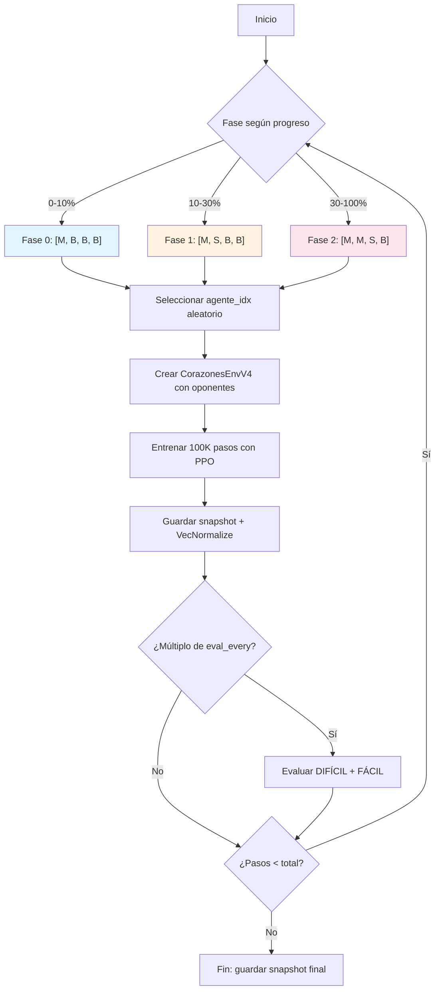

# Documentación de la Versión 4 (v4) — Self-Play Puro con Recompensa Terminal-Only

> **Objetivo de este documento:** Explicar la arquitectura v4 a alguien que conoce la v1 (recompensas por baza, observación básica), detallando qué cambió, por qué cambió y cómo se implementa.

---

## 1. Resumen Ejecutivo

v4 es un **rediseño radical del paradigma de entrenamiento** respecto a v1/v2. Los dos cambios arquitectónicos más importantes son:

| Aspecto | v1 / v2 | v4 |
|---|---|---|
| **Recompensas** | Por baza (inmediata) + final | **Solo final** (terminal-only) |
| **Oponentes** | Bots heurísticos + BotExperto | **Solo bots heurísticos** (sin BotExperto) |
| **Dimensiones** | 220 (v1/v2) | **228** (depuración de v3: 265 → 228) |
| **Red** | MLP [256, 256, 128] | MLP [**512**, 256, 128] |
| **Self-play** | No (solo bots fijos) | **3 fases progresivas** |
| **Rotación** | No | **4 posiciones** (multi-position) |
| **LR** | Constante | **Cosine annealing** 1e-4 → 1e-6 |

---

## 2. Estructura de Archivos

```
src/v4/
├── __init__.py          # Vacío
├── entorno.py           # Re-exporta CorazonesEnvV31 como CorazonesEnvV4
└── train.py             # Pipeline completo de entrenamiento autónomo

src/v3_1/                # ← v4 delega TODA la lógica aquí
├── dimensiones.py       # DIM_V3_1 = 228
├── entorno.py           # CorazonesEnvV31 (terminal-only rewards)
├── observacion.py       # ObservacionBuilderV31 (228 dims)
├── recompensas.py       # Re-exporta desde v2_1
├── red.py               # MLPFeatureExtractorV31 [512, 256, 128]
└── train_mcts.py        # MCTSBuffer para recolección opcional
```

> **Patrón de delegación:** `src/v4/entorno.py` son solo 10 líneas:
>
> ```python
> from src.v3_1.entorno import CorazonesEnvV31 as CorazonesEnvV4
> ```
>
> Esto permite que v4 herede toda la lógica de v3_1 sin duplicación. Si se modifica v3_1, v4 se actualiza automáticamente.

---

## 3. Cambio #1: Recompensa Terminal-Only

### 3.1 Cómo funcionaba en v1/v2

En v1 y v2, **cada `step()` devolvía recompensa inmediata**:

```
step() → reward inmediato (por baza) + reward táctico (Q♠ dump, moon block, etc.)
```

El agente recibía señales como:

- `-3` por cada corazón capturado en la baza
- `-13` por capturar Q♠
- `+12` por descartar Q♠ sobre un rival (v2.1)
- `+15` por bloquear un pozo ajeno (v2.1)
- `+1.0/+0.5` por ganar baza limpia temprano (v2.1)
- `-5` por retener A♠/K♠ con Q♠ activa (v2.1)

**Problemas detectados:**

1. **Crédito temporal difuso:** El agente no sabe si la recompensa de la baza 3 se debe a su acción en la baza 3 o a decisiones anteriores.
2. **Señales contradictorias:** `+12` por Q♠ dump vs `-13` por capturar Q♠ crean objetivos confluyentes difíciles de balancear.
3. **Escala de recompensas ruidosa:** Un agente que evita 3 corazones (-9) y bloquea 1 pozo (+15) puede terminar con +6 neto sin haber jugado bien realmente.
4. **Dependencia de hiperparámetros:** Los pesos de las señales tácticas requieren ajuste manual (¿vale más +12 dump o +15 moon block?).

### 3.2 Cómo funciona en v4

En v4, **SOLO el último `step()` de la mano devuelve recompensa ≠ 0**:

```python
# En CorazonesEnvV31.step():
# Todos los pasos intermedios:
return obs, 0.0, False, False, info   # ← reward = 0.0 SIEMPRE

# Último paso (mano terminada):
reward = 26.0 - float(puntos_agente)   # ← única recompensa
return obs, reward, True, False, info
```

**La fórmula es simple:**

- `reward = 26 - puntos_del_agente`
- Rango: `[0, 26]` (0 = capturó todos los puntos, 26 = mano perfecta)
- Si el agente hace *shooting the moon* (captura los 26 puntos): `reward = 26 - (-26) = 52`

**Por qué funciona mejor:**

1. **Objetivo cristalino:** El agente optimiza UNA sola métrica: minimizar puntos al final de la mano.
2. **Sin conflación de señales:** No hay que balancear pesos entre señales tácticas.
3. **RL más puro:** El algoritmo (PPO) aprende por sí mismo las estrategias intermedias (descartar Q♠, bloquear pozo) porque conducen al objetivo final.
4. **Menos hiperparámetros:** No hay `REWARD_CORAZON`, `REWARD_QS_DUMP`, etc. que ajustar.

### 3.3 Mecanismo interno: las señales tácticas se calculan pero se descartan

La clase `CorazonesEnvV31` **SÍ calcula** internamente las señales tácticas de `CalculadoraRecompensasV21` (Q♠ dump, moon block, etc.) durante `_procesar_baza()` y `_finalizar_mano()`. Sin embargo, el método `step()` **ignora estos valores** y solo emite la recompensa terminal.

Esto se diseñó así para:

- Mantener compatibilidad con el código existente de v2_1/v3_1
- Poder reactivar señales intermedias si se necesita (cambiando una línea en `step()`)
- Facilitar experimentación A/B

```python
# Fragmento clave en CorazonesEnvV31.step():
recompensa = self._ejecutar_jugada_agente(carta)  # ← calcula pero ignora

if self._mano_terminada:
    obs = np.zeros(DIM_V3_1, dtype=np.float32)
    reward = self._calcular_recompensa_terminal()  # ← 26 - puntos
    return obs, reward, True, False, self._info_final()

# ... jugar oponentes (también ignora recompensas intermedias)
self._jugar_oponentes()

return obs, 0.0, False, False, self._info_parcial()  # ← SIEMPRE 0.0
```

---

## 4. Cambio #2: Vector de Observación de 228 Dimensiones

### 4.1 Evolución desde v1

| Versión | Dimensiones | Notas |
|---|---|---|
| v1 | 220 | Vector estándar actual (canónico) |
| v3 | 265 | Añadió 45 features experimentales |
| v3_1 → **v4** | **228** | Depuración: eliminó 37 features redundantes/inferibles/bajo valor |

### 4.2 Qué se eliminó respecto a v3 (265 → 228)

| Features eliminados | Razón |
|---|---|
| Cartas restantes /13 (duplicado) | Ya existe en raw [189:193] |
| Prob Q♠ v1 (duplicado) | Redundante con [199:203] |
| Puntos /26 (duplicado) | Ya existe en raw [176:180] |
| Bazas restantes | Inferible de número de baza |
| Q♠ capturada | Inferible de Q♠ tracker [182:187] |
| `all_void_X` (4 dims) | Inferible de matriz de vacíos |
| Riesgo baza | Bajo valor predictivo |
| Cerca de 100 | Inferible de puntuación histórica |
| Soy líder | Inferible de puntuaciones |
| Altas restantes /4 | Inferible de control de palo |
| Corazones capturados /13 | Sustituido por patrones de rivales |
| Alerta pozo | Inferible de patrones de rivales |
| `debo_arriesgar`, `puedo_alimentar` | Bajo valor, nunca se activaban |
| Lidero picas forzado, puedo quemar palo | Bajo valor |
| Mano terminal | Poco frecuente |

### 4.3 Qué se añadió respecto a v3 (12 dims nuevas)

| Bloque | Dims | Contenido |
|---|---|---|
| ♥ altos rivales | [215:219] | J/Q/K/A de ♥ capturados por cada rival → detección de pozo |
| ♠ altas rivales | [219:223] | J/Q/K/A de ♠ jugadas por cada rival → detección de evasión Q♠ |
| ¿Jugó ♥? | [223:227] | Booleano: ¿cada rival ya jugó corazón? → quién rompió |

### 4.4 Estructura completa del vector de 228 dimensiones

```
Bloque 1: Cartas [0:156]
  [0:52]     Mano del agente (one-hot, 52 cartas)
  [52:104]   Mesa actual (one-hot, cartas en la baza)
  [104:156]  Cementerio (one-hot, bazas ganadas de todos)

Bloque 2: Vacíos [156:172]
  [156:172]  Matriz 4 jugadores × 4 palos: ¿jugador J es void en palo P?
             Orden: [agente_p0..p3, rival1_p0..p3, rival2_p0..p3, rival3_p0..p3]

Bloque 3: Puntuaciones [172:181]
  [172:176]  Puntaje histórico /100 (relativo al agente)
  [176:180]  Puntos mano actual RAW 0-26 (relativo al agente)
  [180]      Corazones rotos (0.0 / 1.0)

Bloque 4: Q♠ + Posición [181:188]
  [181]      Posición en baza: 0.0, 0.33, 0.66, 1.0
  [182:187]  Q♠ tracker: one-hot 5 estados
             [desconocida, agente, rival1, rival2, rival3]
  [187]      pozo_viable: ¿es viable intentar shooting the moon?

Bloque 5: Estado de la mano [188:194]
  [188]      Número de baza / 13.0
  [189:193]  Cartas restantes por palo (raw 0-13, en manos rivales)
  [193]      Palo de salida: 0.0 si None, else palo/3.0

Bloque 6: Q♠ enriquecido [194:203]
  [194:198]  Peligro Q♠ por palo (probabilidad × peligrosidad)
  [198]      Peligro Q♠ inminente (tengo Q♠ + otra ♠)
  [199:203]  Probabilidad Q♠ por jugador (relativo, usa voids)

Bloque 7: Control de palo [203:215]
  [203:207]  Altas (J/Q/K/A) en mi mano por palo (raw count 0-4)
  [207:211]  Máxima absoluta por palo (1.0 si tengo la más alta viva)
  [211:215]  Control de palo: mis altas / total altas vivas

Bloque 8: Patrones de rivales [215:227] ← NUEVO vs v3
  [215:219]  ♥ altos (J/Q/K/A) capturados por rival → ¿pozo en curso?
  [219:223]  ♠ altas (J/Q/K/A) jugadas por rival → ¿evasión de Q♠?
  [223:227]  ¿Ya jugó ♥ cada rival? → ¿quién rompió corazones?

Bloque 9: Forzado [227]
  [227]      1.0 si solo hay 1 carta legal (forzado), 0.0 si no
```

> **Nota importante:** Todas las posiciones de jugadores son **relativas al agente** (`(idx - agente_idx) % 4`). El orden es siempre `[agente, rival+1, rival+2, rival+3]`.

---

## 5. Cambio #3: Self-Play Puro en 3 Fases

### 5.1 Cómo funcionaba en v1/v2

En v1 y v2, el agente entrenaba **siempre contra los mismos 3 bots heurísticos fijos** (`bot_conservador`, `bot_agresivo`, `bot_evasivo`). Esto causaba **overfitting**: el modelo aprendía a explotar las debilidades de bots específicos pero no generalizaba.

### 5.2 Cómo funciona en v4

v4 implementa **Fictitious Self-Play** con 3 fases progresivas:

| Fase | Progreso | Composición | Objetivo |
|---|---|---|---|
| **Fase 0** | 0% – 10% | `[Modelo, Bot, Bot, Bot]` | Calentamiento: aprender reglas básicas contra bots |
| **Fase 1** | 10% – 30% | `[Modelo, Snapshot, Bot, Bot]` | Introducir diversidad: un snapshot histórico propio |
| **Fase 2** | 30% – 100% | `[Modelo, Modelo, Snapshot, Bot]` | Self-play: 2 copias del modelo + 1 snapshot + 1 bot |

**Pool de snapshots:**

- Se cargan del directorio `models/{version}/snapshots/`
- Mínimo 100K pasos para entrar al pool
- Máximo 50 snapshots en el pool (los más recientes)
- Se seleccionan aleatoriamente en cada episodio

**Sin BotExperto:** A diferencia de versiones anteriores, v4 **NO incluye BotExperto** como oponente. La hipótesis es que el modelo debe descubrir estrategias avanzadas (descartar Q♠, bloquear pozo) por sí mismo mediante self-play, sin ser "enseñado" por una heurística experta.

### 5.3 Rotación Multi-Posición

El agente entrena desde **las 4 posiciones** (agente_idx = 0, 1, 2, 3), seleccionadas aleatoriamente en cada chunk de entrenamiento. Esto fuerza al modelo a generalizar a cualquier posición en la mesa, no solo a ser el primer jugador.

---

## 6. Cambio #4: Red Neuronal

### 6.1 Comparación

| Componente | v1 / v2 | v4 |
|---|---|---|
| Arquitectura | MLP [256, 256, 128] | MLP [**512**, 256, 128] |
| Features de entrada | 220 | **228** |
| Features de salida | 128 | 128 |
| Activación | ReLU | ReLU |
| Clase | `CorazonesFeatureExtractor` | `MLPFeatureExtractorV31` |

### 6.2 Implementación

```python
class MLPFeatureExtractorV31(BaseFeaturesExtractor):
    """MLP de 3 capas: 228 → 512 → 256 → 128 (ReLU)."""
    def __init__(self, observation_space, features_dim=128, net_arch=None):
        if net_arch is None:
            net_arch = [512, 256, 128]
        # Construye Sequential: Linear → ReLU → Linear → ReLU → Linear → ReLU
        ...

def obtener_policy_kwargs_v31(features_dim=128, net_arch=None):
    return {
        "features_extractor_class": MLPFeatureExtractorV31,
        "features_extractor_kwargs": {"features_dim": 128, "net_arch": [512, 256, 128]},
        "net_arch": [],  # sin capas adicionales en policy/value head
    }
```

La primera capa se amplió de 256 a 512 neuronas para manejar las 228 dimensiones de entrada (+8 vs v1) con suficiente capacidad representacional.

---

## 7. Cambio #5: Cosine Learning Rate

v4 usa **cosine annealing** en lugar de LR constante:

```python
LR_MAX = 1e-4
LR_MIN = 1e-6

def cosine_lr_schedule(progress_remaining: float) -> float:
    progress = 1.0 - progress_remaining
    return LR_MIN + 0.5 * (LR_MAX - LR_MIN) * (1.0 + math.cos(math.pi * progress))
```

El LR decae suavemente de `1e-4` a `1e-6` durante el entrenamiento, permitiendo exploración agresiva al inicio y refinamiento al final.

---

## 8. Hiperparámetros Completos

```python
# Modelo PPO
modelo = MaskablePPO(
    "MlpPolicy", venv,
    policy_kwargs=policy_kwargs,     # MLP [512, 256, 128]
    learning_rate=cosine_lr_schedule, # 1e-4 → 1e-6
    n_steps=2048,                     # Pasos por rollout
    batch_size=256,                   # Mini-batch size
    n_epochs=10,                      # Épocas por actualización
    gamma=0.995,                      # Factor de descuento
    gae_lambda=0.95,                  # GAE λ
    clip_range=0.2,                   # PPO clip range
    ent_coef=2e-3,                    # Coeficiente de entropía
    vf_coef=0.25,                     # Coeficiente de value loss
    max_grad_norm=0.5,                # Gradient clipping
)

# VecNormalize
VecNormalize(venv,
    norm_obs=True, norm_reward=True,
    clip_obs=10.0, clip_reward=10.0,
    gamma=0.995, epsilon=1e-8,
)

# Entrenamiento
total_steps = 10_000_000     # 10M pasos totales
snapshot_every = 100_000     # Guardar cada 100K pasos
eval_every = 100_000         # Evaluar cada 100K pasos
eval_partidas = 100          # Partidas por evaluación
```

---

## 9. Evaluación

v4 evalúa contra **dos configuraciones de dificultad**:

| Formato | Composición | Partidas |
|---|---|---|
| **DIFÍCIL** | `[Modelo, Experto, Experto, BotRotativo]` | 100 |
| **FÁCIL** | `[Modelo, Experto, Bot, Bot]` | 50 |

Métricas reporteadas:

- **WR≤8**: Win rate (porcentaje de manos donde el modelo toma ≤8 puntos)
- **Top1 rate**: Porcentaje de manos donde el modelo queda en 1ᵉʳ lugar
- **Top2 rate**: Porcentaje donde queda en 1° o 2° lugar
- **Avg Score**: Puntuación media del modelo

> Aunque no se usa BotExperto en el entrenamiento, **sí se usa en la evaluación** como benchmark de referencia.

---

## 10. Resumen: Qué Cambió y Por Qué

| Cambio | v1 → v4 | Motivación |
|---|---|---|
| Reward terminal-only | Señales por baza → solo `26 - puntos` al final | Objetivo cristalino, sin conflación de señales, RL más puro |
| 228 dimensiones | 220 → 228 depuradas (desde 265) | Eliminar ruido, añadir patrones de rivales |
| Self-play 3 fases | Sin self-play → 3 fases progresivas | Evitar overfitting a bots fijos |
| Rotación multi-posición | 1 posición → 4 posiciones | Generalizar a cualquier asiento |
| Sin BotExperto | Con BotExperto → solo bots heurísticos | Descubrir estrategias por sí mismo |
| MLP más ancha | [256,256,128] → [512,256,128] | Mayor capacidad para 228 dims |
| Cosine LR | Constante → 1e-4→1e-6 | Exploración → refinamiento |

---

## 11. Cómo Ejecutar

```powershell
# Activar entorno virtual
.venv\Scripts\Activate.ps1

# Entrenar desde cero (10M pasos)
python -m src.v4.train --total-steps 10000000 --output-dir models/v4

# Con GPU Intel Arc
python -m src.v4.train --total-steps 10000000 --device dml --output-dir models/v4

# Reanudar desde snapshot
python -m src.v4.train --resume models/v4/snapshots/snapshot_0050000000 --total-steps 10000000

# Con recolección MCTS (solo datos, sin BC fine-tune)
python -m src.v4.train --total-steps 10000000 --mcts --output-dir models/v4_mcts

# Tests
python -m pytest tests/v4/test_v4.py -v
```

---

## 12. Diagrama de Flujo del Entrenamiento


